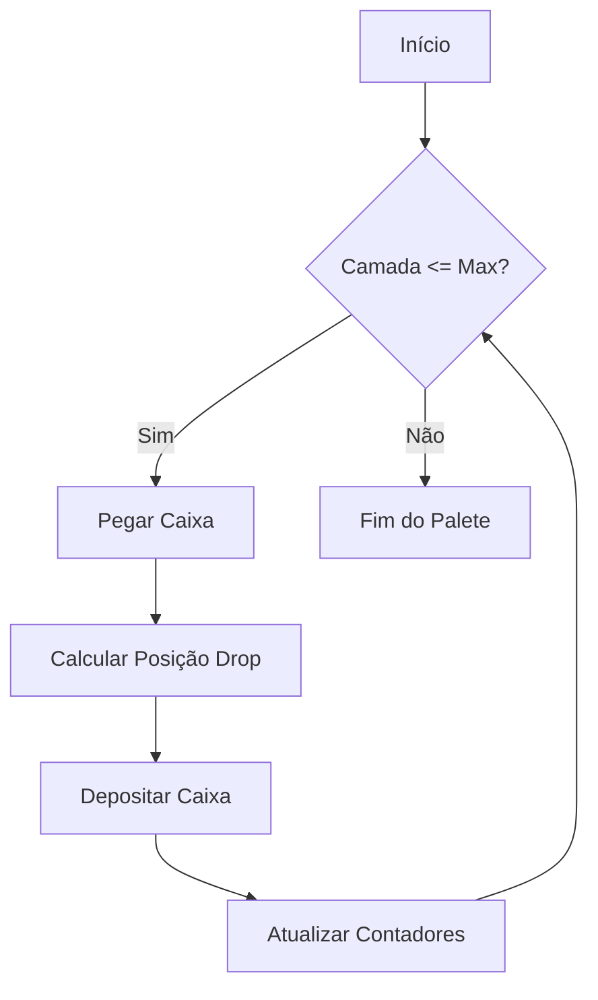

# Sistema de Paletização - Dobot CR20A

Este projeto consiste em um sistema de paletização automatizado desenvolvido em **Lua**, projetado para operar com o robô colaborativo **Dobot CR20A**. O script gerencia a lógica de "Pick and Place" (pega e coloca), calculando automaticamente as posições de depósito com base nas dimensões da caixa e na configuração do palete.

## 📋 Funcionalidades

*   **Cálculo Dinâmico de Posições:** Calcula as coordenadas de destino (X, Y, Z) baseando-se no tamanho da caixa e na camada atual.
*   **Controle de Camadas:** Suporte para múltiplas camadas de empilhamento (`max_layers`).
*   **Verificação de Pega:** Utiliza sensores digitais para confirmar se a caixa foi pega corretamente antes do movimento.
*   **Movimentação Híbrida:** Combina movimentos articulares (`movej`) para deslocamentos rápidos e lineares (`movel`) para aproximações precisas.

## 🛠️ Estrutura do Projeto

O projeto é dividido em três arquivos principais para facilitar a manutenção:

*   `main.lua`: Ponto de entrada do script. Gerencia o loop principal e o ciclo de vida da paletização.
*   `setting.lua`: Arquivo de configuração. Contém as dimensões das caixas, geometria do palete e pontos de referência.
*   `controller.lua`: Contém a lógica de controle, cálculos matemáticos de offset e comandos de movimento do robô.

## ⚙️ Configuração (setting.lua)

Antes de executar, ajuste as variáveis no arquivo `setting.lua` conforme o ambiente físico:

```lua
-- Dimensões da Caixa (mm)
box_length = 400
box_width = 300
box_height = 250
gap = 5 -- Folga entre caixas

-- Configuração do Grid
pallet_rows = 3 -- Número de caixas no eixo Y
pallet_cols = 2 -- Número de caixas no eixo X
max_layers = 4  -- Número total de camadas

-- Pontos de Referência (World Coordinates)
p_pick = { ... } -- Local onde o robô pega a caixa
pallet_frame_origin = { ... } -- Canto inicial do palete
```

## 🔌 Requisitos de Hardware e I/O

O script assume a seguinte configuração de Entradas e Saídas (I/O) no controlador do Dobot:

| Tipo | Porta | Função | Descrição |
|---|---|---|---|
| **DO** (Saída Digital) | `1` | Ativar Vácuo | Liga/Desliga a ventosa/garra. |
| **DI** (Entrada Digital) | `1` | Sensor de Vácuo | Confirma se a peça está presa (Pressostato). |

## 🚀 Como Executar

1.  Carregue os arquivos `.lua` no controlador do Dobot ou no software de simulação (ex: DobotStudio / DobotSCStudio).
2.  Certifique-se de que os pontos `p_pick` e `pallet_frame_origin` foram ensinados (teach) corretamente para o seu ambiente físico.
3.  Execute o arquivo `main.lua`.

## 📐 Lógica de Empilhamento

O sistema preenche o palete na seguinte ordem:
1.  Preenche as colunas (Eixo X).
2.  Preenche as linhas (Eixo Y).
3.  Sobe para a próxima camada (Eixo Z).



## 📝 Autor

Desenvolvido para integração com Dobot CR20A.

---
*Nota: Este código requer as bibliotecas padrão de movimentação do Dobot (`movel`, `movej`, `set_digital_out`, etc).*